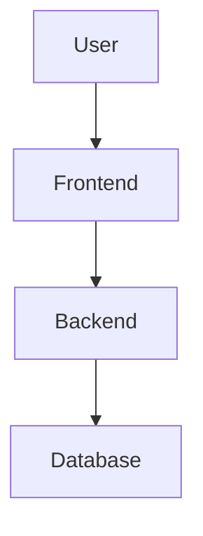

# 📝 Documentation Management Guide

This guide provides comprehensive instructions, guidelines, and best practices for managing, writing, updating, and maintaining documentation in the project.

## 🎯 Documentation Philosophy

### Core Principles

1. **Single Source of Truth**: All documentation lives in `/docs` using Docusaurus
2. **Always Up-to-Date**: Documentation is updated alongside code changes
3. **User-Centric**: Write for the intended audience (users, developers, AI agents)
4. **Accessible**: Clear, concise, and easy to understand
5. **Discoverable**: Properly organized and cross-referenced
6. **Maintainable**: Easy to update and keep current

### Why Good Documentation Matters

- **Reduces onboarding time** for new contributors
- **Improves code quality** through better understanding
- **Enables collaboration** across teams and time zones
- **Serves as a contract** between different parts of the system
- **Supports AI agents** working with the codebase

## 📚 Documentation Structure

### Overview

```text
/docs/                          # Docusaurus documentation root
├── docs/                       # Documentation content
│   ├── functional/            # User-facing documentation
│   │   ├── intro.md          # Introduction and overview
│   │   ├── quickstart.md     # Quick start guide
│   │   └── admin-host-guide.md  # Admin/host guide
│   └── technical/            # Developer documentation
│       ├── architecture/      # System architecture
│       │   ├── index.md      # Architecture overview
│       │   ├── backend.md    # Backend architecture
│       │   └── frontend.md   # Frontend architecture
│       ├── design-system.md  # Design system guide
│       ├── docker-guide.md   # Docker guide
│       ├── testing.md        # Testing guide
│       ├── i18n.md          # Internationalization
│       ├── accessibility.md  # Accessibility guide
│       ├── deployment.md     # Deployment guide
│       ├── monitoring.md     # Monitoring guide
│       ├── security.md       # Security guide
│       ├── quick-reference.md  # Command reference
│       └── documentation-guide.md  # This file
├── src/                       # Docusaurus theme and components
├── static/                    # Static assets (images, files)
├── docusaurus.config.ts       # Docusaurus configuration
├── sidebars.ts               # Sidebar navigation
└── package.json              # Dependencies and scripts

/CONTRIBUTING.md              # Contribution guidelines (references /docs)
/AGENTS.md                   # AI agent instructions (references /docs)
/README.md                   # Project overview (references /docs)
```

### Documentation Categories

#### 1. **Functional Documentation** (`/docs/docs/functional/`)

- **Audience**: End users, quiz hosts, admins
- **Purpose**: How to use the application
- **Examples**: User guides, tutorials, feature explanations
- **Tone**: User-friendly, step-by-step, with screenshots

#### 2. **Technical Documentation** (`/docs/docs/technical/`)

- **Audience**: Developers, DevOps, QA engineers, AI agents
- **Purpose**: How the system works and how to work with it
- **Examples**: Architecture, API docs, testing guides, deployment
- **Tone**: Technical, precise, comprehensive

#### 3. **Root Documentation Files**

- **CONTRIBUTING.md**: How to contribute (lightweight, references `/docs`)
- **AGENTS.md**: Instructions for AI agents (lightweight, references `/docs`)
- **README.md**: Project overview (lightweight, references `/docs`)
- **Purpose**: Entry points that direct to comprehensive docs in `/docs`

## ✍️ Writing Guidelines

### General Best Practices

1. **Start with Why**: Explain the purpose before the how
2. **Use Clear Headings**: Descriptive, hierarchical structure (H1 → H2 → H3)
3. **Be Concise**: Short sentences, active voice, avoid jargon
4. **Use Examples**: Code snippets, screenshots, diagrams
5. **Think About Search**: Use keywords users would search for
6. **Link Generously**: Cross-reference related documentation
7. **Keep It Current**: Update docs when code changes

### Writing Style

#### Voice and Tone

- ✅ **Active voice**: "Run `npm install`" (not "The command should be run")
- ✅ **Second person**: "You can configure..." (not "One can configure...")
- ✅ **Present tense**: "The server listens on port 3001" (not "will listen")
- ✅ **Direct and clear**: "This feature requires Node.js 18+" (not "It might be necessary to...")

#### Formatting Conventions

**Code Blocks:**

```bash
# Always specify the language
npm install

# Include context/location when needed
cd /path/to/project
npm test
```

**File Paths:**

- Use inline code: `path/to/file.ts`
- Always use forward slashes: `/docs/docs/technical/`
- Use absolute paths from project root when applicable

**Commands:**

- Use code blocks for multi-line commands
- Use inline code for single commands: `npm install`
- Show output when helpful

**Emphasis:**

- **Bold** for important terms, UI elements, warnings
- _Italic_ for emphasis (use sparingly)
- `Code` for filenames, commands, variables, code

**Lists:**

- Use numbered lists for sequential steps
- Use bullet lists for non-sequential items
- Keep list items parallel in structure

**Links:**

- Use descriptive link text: `[Testing Guide](testing.md)` (not `[click here](testing.md)`)
- Use relative links within docs: `[Architecture](architecture/index.md)`
- Use absolute links for external resources: `https://docusaurus.io/`

### Markdown Conventions

#### Front Matter

Every documentation file should include front matter:

```markdown
---
sidebar_position: 1
title: Page Title (optional, defaults to H1)
---
```

#### Headings

```markdown
# H1 - Page Title (only one per file)

## H2 - Main Section

### H3 - Subsection

#### H4 - Details (use sparingly)
```

#### Emojis

Use emojis consistently for visual navigation:

- 🎯 Goals, objectives, principles
- 📚 Documentation, guides, references
- 🏗️ Architecture, structure, design
- 🛠️ Development, tools, setup
- 🚀 Deployment, production, operations
- 🔐 Security, authentication, authorization
- ✅ Success, recommended, best practices
- ❌ Failures, warnings, antipatterns
- 💡 Tips, notes, important information
- ⚠️ Warnings, cautions, breaking changes

#### Admonitions (Callouts)

Docusaurus supports admonitions for special notes:

```markdown
:::note
This is a note
:::

:::tip
This is a helpful tip
:::

:::info
This is informational
:::

:::warning
This is a warning
:::

:::danger
This is dangerous - be careful!
:::
```

### Code Documentation

#### Code Snippets

**Always include language specifier and explanatory comments:**

```typescript
// Always include comments explaining what the code does
const example = (param: string): void => {
  console.log(param);
};
```

**To create a code block in Markdown:**

1. Start with three backticks followed by the language name (e.g., `typescript`, `bash`, `json`)
2. Add your code
3. End with three backticks

#### API Documentation

**Structure for documenting functions/methods:**

```markdown
### Function Name

**Description**: Brief description of what it does

**Parameters**:

- `param1` (string): Description of parameter
- `param2` (number, optional): Description of optional parameter

**Returns**: Description of return value

**Example**:
(code block with usage example)
```

#### Configuration Examples

**Always include before/after examples for configuration:**

```markdown
**Before:**
(JSON/YAML code block with old configuration)

**After:**
(JSON/YAML code block with new configuration)
```

## 📋 Documentation Types

### 1. **Tutorials** (Learning-Oriented)

- **Goal**: Help newcomers learn by doing
- **Format**: Step-by-step instructions
- **Example**: "Getting Started"
- **Location**: `functional/` or `technical/` depending on audience

**Structure:**

```markdown
# Tutorial Title

## What You'll Learn

- Learning objective 1
- Learning objective 2

## Prerequisites

- Requirement 1
- Requirement 2

## Step 1: First Step

Instructions...

## Step 2: Next Step

Instructions...

## Next Steps

Where to go from here...
```

### 2. **How-To Guides** (Task-Oriented)

- **Goal**: Help users accomplish specific tasks
- **Format**: Clear steps to solve a problem
- **Example**: "How to Deploy to Production"
- **Location**: Usually `technical/`

**Structure:**

```markdown
# How to [Task]

## Overview

Brief explanation of the task

## Prerequisites

- What you need before starting

## Steps

### 1. First Step

Instructions...

### 2. Second Step

Instructions...

## Troubleshooting

Common issues and solutions

## Related

Links to related documentation
```

### 3. **Reference Documentation** (Information-Oriented)

- **Goal**: Provide technical descriptions
- **Format**: Systematic, comprehensive
- **Example**: "API Reference", "Command Reference"
- **Location**: `technical/quick-reference.md` or dedicated files

**Structure:**

```markdown
# Reference Title

## Command/API/Feature Name

**Description**: What it does

**Syntax**: How to use it

**Options/Parameters**:

- Option 1: Description
- Option 2: Description

**Examples**:
\`\`\`bash
example command
\`\`\`

**See Also**: Related references
```

### 4. **Explanation/Conceptual** (Understanding-Oriented)

- **Goal**: Clarify and illuminate topics
- **Format**: Discussion, context, background
- **Example**: "Architecture Overview", "Design Principles"
- **Location**: Usually `technical/architecture/`

**Structure:**

```markdown
# Concept Title

## Overview

High-level explanation

## Why This Matters

Context and importance

## How It Works

Detailed explanation with diagrams

## Trade-offs

Benefits and limitations

## Related Concepts

Links to related topics
```

## 🔄 Documentation Workflow

### When to Update Documentation

**ALWAYS update documentation when:**

- ✅ Adding new features or functionality
- ✅ Changing existing behavior or APIs
- ✅ Modifying configuration options
- ✅ Updating dependencies with breaking changes
- ✅ Changing deployment procedures
- ✅ Fixing bugs that affect documented behavior
- ✅ Adding new environment variables
- ✅ Updating security practices

**Consider updating documentation when:**

- 🤔 Improving code clarity or architecture
- 🤔 Adding performance optimizations
- 🤔 Refactoring without changing behavior
- 🤔 Adding internal tooling

### Documentation Update Process

1. **Identify Affected Docs**
   - Which documentation sections does your change impact?
   - User-facing? Developer-facing? Both?

2. **Update Documentation First** (Documentation-Driven Development)
   - Write/update docs as part of feature development
   - Use docs to clarify requirements and design
   - Treat docs as code: review, test, iterate

3. **Keep Changes Minimal**
   - Update only what changed
   - Don't refactor unrelated documentation
   - Maintain consistency with existing style

4. **Add Examples**
   - Include code examples for new features
   - Show before/after for changes
   - Provide real-world use cases

5. **Test Documentation**
   - Build docs locally: `cd docs && npm run build`
   - Check for broken links
   - Verify code examples work
   - Preview visually: `cd docs && npm start`

6. **Update Cross-References**
   - Update related documentation sections
   - Add links from root files (readme, CONTRIBUTING, AGENTS.md)
   - Update sidebar if adding new pages

7. **Commit with Documentation**
   - Include docs in the same commit as code changes
   - Use conventional commits: `docs: update deployment guide`
   - Or combined: `feat(quiz): add timer pause (with docs)`

### Pull Request Documentation Checklist

When submitting a PR:

- [ ] Documentation updated for all changes
- [ ] Code examples tested and working
- [ ] Screenshots included for UI changes
- [ ] Links verified (no broken references)
- [ ] Spelling and grammar checked
- [ ] Builds without errors: `cd docs && npm run build`
- [ ] Cross-references updated
- [ ] Changelog/release notes updated (if applicable)

## 🎨 Style Guide

### Language and Grammar

**Capitalization:**

- ✅ Sentence case for headings: "How to deploy to production"
- ❌ Title Case for headings: "How To Deploy To Production"
- ✅ Proper nouns capitalized: "Docker", "React"
- ✅ UI elements as shown: "Click **Save**"

**Punctuation:**

- ✅ Period at end of sentences
- ❌ Period at end of headings
- ✅ Colon before code blocks or lists
- ✅ Oxford comma in lists: "a, b, and c"

**Numbers:**

- ✅ Numbers 0-9 spelled out in prose: "three steps"
- ✅ Numbers 10+ as numerals: "15 users"
- ✅ Always numerals for technical values: "Node.js 18", "port 3001"

**Technical Terms:**

- ✅ Consistent terminology (pick one and stick with it)
- ✅ Define acronyms on first use: "Domain-Driven Design (DDD)"
- ✅ Use industry-standard terms when available

### Visual Elements

**Screenshots:**

- Always include for UI changes
- Use PNG format for clarity
- Store in `/docs/static/img/`
- Reference: ``
- Include alt text for accessibility
- Highlight important areas if needed

**Diagrams:**

- Use Mermaid for architecture diagrams (Docusaurus supports it)
- Use ASCII art for simple layouts
- Store complex diagrams as SVG in `/docs/static/img/`
- Always include text descriptions

**Mermaid Example:**

````markdown

````

**Tables:**

```markdown
| Column 1 | Column 2 | Column 3 |
| -------- | -------- | -------- |
| Value 1  | Value 2  | Value 3  |
| Value 4  | Value 5  | Value 6  |
```

### File and Folder Naming

**Filenames:**

- Use kebab-case: `documentation-guide.md`
- Be descriptive: `docker-guide.md` not `docker.md`
- Use `.md` extension for Markdown files

**Folder Names:**

- Use kebab-case: `technical/`, `functional/`
- Group logically by audience/purpose
- Keep shallow hierarchy (max 2-3 levels)

**Image Names:**

- Descriptive: `architecture-overview.png`
- Include context: `login-screen-mobile.png`
- Use kebab-case

## 🛠️ Docusaurus-Specific Guidelines

### Configuration

**Adding New Pages:**

1. Create `.md` file in appropriate directory
2. Add front matter:

```markdown
---
sidebar_position: 5
title: Optional Custom Title
---
```

3. Update `sidebars.ts` if needed:

```typescript
{
  type: 'category',
  label: 'Category Name',
  items: [
    'path/to/doc',
  ],
}
```

**Sidebar Position:**

- Lower numbers appear first
- Use gaps (1, 5, 10) to allow insertions
- Group related docs with similar positions

### Local Development

```bash
# Quick start: Open documentation (recommended)
make docs

# OR manually:
# Navigate to docs directory
cd docs

# Install dependencies (first time only)
npm install

# Start development server
npm start

# Build for production (test before committing)
npm run build

# Serve production build locally
npm run serve
```

**Note**: The `make docs` command automatically navigates to the docs directory and starts the development server. The documentation will be available at <http://localhost:3000> with hot-reload enabled.

### Common Docusaurus Features

**Code Blocks with Title:**

```markdown
\`\`\`typescript title="src/example.ts"
const example = 'code';
\`\`\`
```

**Code Block with Line Highlighting:**

```markdown
\`\`\`typescript {2,4-6}
const a = 1;
const b = 2; // Highlighted
const c = 3;
const d = 4; // Highlighted
const e = 5; // Highlighted
const f = 6; // Highlighted
\`\`\`
```

**Tabs:**

```markdown
import Tabs from '@theme/Tabs';
import TabItem from '@theme/TabItem';

<Tabs>
  <TabItem value="npm" label="npm">
    \`\`\`bash
    npm install
    \`\`\`
  </TabItem>
  <TabItem value="yarn" label="Yarn">
    \`\`\`bash
    yarn install
    \`\`\`
  </TabItem>
</Tabs>
```

## ✅ Quality Checklist

Before finalizing documentation, verify:

### Content Quality

- [ ] **Accurate**: Information is correct and up-to-date
- [ ] **Complete**: Covers all necessary information
- [ ] **Clear**: Easy to understand for target audience
- [ ] **Concise**: No unnecessary words or repetition
- [ ] **Consistent**: Follows style guide and conventions
- [ ] **Examples**: Includes working code examples
- [ ] **Context**: Explains why, not just how

### Technical Quality

- [ ] **Code Examples Work**: All examples tested and functional
- [ ] **Links Work**: No broken internal or external links
- [ ] **Builds Successfully**: `npm run build` passes
- [ ] **No Warnings**: Docusaurus build shows no warnings
- [ ] **Images Load**: All screenshots and diagrams display
- [ ] **Syntax Highlighted**: Code blocks have language specified
- [ ] **Mobile-Friendly**: Readable on mobile devices

### Structural Quality

- [ ] **Front Matter**: Correct sidebar position and metadata
- [ ] **Headings**: Logical hierarchy (H1 → H2 → H3)
- [ ] **TOC-Friendly**: Headings create useful table of contents
- [ ] **Cross-Referenced**: Links to related documentation
- [ ] **Discoverable**: Included in sidebar navigation
- [ ] **Searchable**: Uses keywords users would search

### Accessibility

- [ ] **Alt Text**: All images have descriptive alt text
- [ ] **Semantic HTML**: Uses proper heading levels
- [ ] **Color**: Not relying on color alone to convey information
- [ ] **Links**: Descriptive link text (not "click here")
- [ ] **Tables**: Have headers for screen readers

## 🔧 Maintenance Best Practices

### Regular Documentation Review

**Monthly:**

- Review analytics (if available) to find popular/unpopular pages
- Check for outdated screenshots or examples
- Verify external links still work
- Look for common support questions that should be documented

**Quarterly:**

- Review all documentation for accuracy
- Update dependencies and version numbers
- Reorganize if structure no longer serves users
- Archive or remove obsolete documentation

**Per Release:**

- Update version-specific information
- Add release notes or changelog entries
- Update screenshots if UI changed
- Review and update getting started guides

### Documentation Debt

Like technical debt, documentation debt accumulates. Prevent it by:

1. **Treating docs as code**: Review, test, refactor
2. **Boy Scout Rule**: Leave docs better than you found them
3. **Mark TODOs**: Use `<!-- TODO: description -->` for future work
4. **Track Issues**: Create GitHub issues for major doc updates needed
5. **Assign Ownership**: Someone should own each documentation section

### Deprecation Process

When deprecating features:

1. **Mark as deprecated** in documentation:

```markdown
:::warning Deprecated
This feature is deprecated and will be removed in v3.0.0.
Use [new feature](link) instead.
:::
```

2. **Provide migration path**: Show how to update
3. **Keep old docs**: Don't delete until feature is removed
4. **Update changelogs**: Document deprecation in release notes
5. **Remove after grace period**: Remove docs when feature is removed

## 🤖 AI Agent Considerations

### Writing for AI Agents

AI agents (GitHub Copilot, Claude, etc.) use documentation extensively. Help them by:

1. **Be Explicit**: Don't assume context or knowledge
2. **Use Examples**: Show, don't just tell
3. **Link Comprehensively**: AI agents follow links
4. **Follow Conventions**: Consistency helps AI understanding
5. **Include Metadata**: Front matter helps AI categorize
6. **Update AGENTS.md**: Keep AI instructions current

### AI-Friendly Patterns

**Good:**

```markdown
## How to Run Tests

\`\`\`bash

# Navigate to backend directory

cd backend

# Run all tests

npm test

# Run specific test file

npm test -- users.test.ts
\`\`\`
```

**Avoid:**

```markdown
## Testing

Run the tests (you know how).
```

## 📖 Resources

### Internal Documentation

- [Architecture Overview](architecture/index.md) - System architecture overview
- [Backend Architecture](architecture/backend.md) - Backend architecture
- [Frontend Architecture](architecture/frontend.md) - Frontend architecture
- [CONTRIBUTING.md](https://github.com/cloud-native-aixmarseille/quiz-app/blob/main/CONTRIBUTING.md) - Contribution guidelines
- [AGENTS.md](https://github.com/cloud-native-aixmarseille/quiz-app/blob/main/AGENTS.md) - AI agent instructions

### External Resources

- [Docusaurus Documentation](https://docusaurus.io/docs)
- [Markdown Guide](https://www.markdownguide.org/)
- [Google Developer Documentation Style Guide](https://developers.google.com/style)
- [Microsoft Writing Style Guide](https://docs.microsoft.com/en-us/style-guide/welcome/)
- [Write The Docs](https://www.writethedocs.org/)

## 🆘 Getting Help

### Questions About Documentation?

1. Check this guide first
2. Look for similar examples in existing docs
3. Ask in GitHub issues or discussions
4. Reference external style guides

### Reporting Documentation Issues

Create a GitHub issue with:

- **Title**: "Docs: [brief description]"
- **Type**: Documentation
- **Description**: What's wrong or missing
- **Location**: Which file(s) affected
- **Suggested Fix**: If you have one

---

**Last Updated**: 2025-11-04  
**Maintained By**: Pleey Development Team  
**Questions?** Open a GitHub issue with the `documentation` label.
